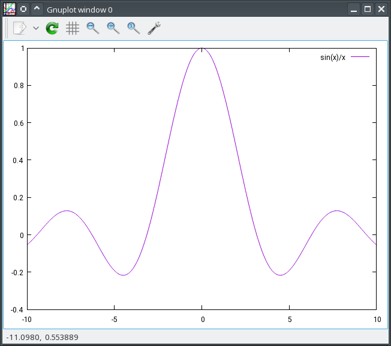

# gnu-plotstream
Simple C++ interface for Gnuplot with stream ability like ```std::cout``` and so on.

Small but it supports the full functionality of Gnuplot.

For Linux only! Sorry.

Example:
```C++
#include <gnuplotstream.hpp>

using namespace std;
using namespace gpstr; // Namespace for Gnu-Plot-STReam

int main( void )
{
   cout << "Minimal test-program plotting the function si(x)" << endl;
   try
   {
      PlotStream plot;
      plot << "plot sin(x)/x" << endl;

      cout << "Press the enter key to end." << endl;
      ::fgetc( stdin );
   }
   catch( exception& e )
   {
      cerr << e.what() << endl;
      return EXIT_FAILURE;
   }
   return EXIT_SUCCESS;
}
```
Result:



If PlotStream has to invoke Gnuplot with additional command line options,
then these options are the first parameter of the constructor of PlotStream.

Example:
```C++
PlotStream plot( "-noraise --persist" );
```
Alternatively you can define the macro ```GPSTR_DEFAULT_OPTIONS``` in your makefile.

By default the class PlotStream expect the executable of Gnuplot in ```/usr/bin/gnuplot```.
If Gnuplot has been installed in a other directory,
then the executable file has to be the second parameter of the Constructor:
```C++
PlotStream plot( GPSTR_DEFAULT_OPTIONS, "/path/to/my/gnuplot" );
```
or:
```C++
PlotStream plot( "-noraise --persist", "/path/to/my/gnuplot" );
```
Alternatively you can define the macro ```GPSTR_DEFAULT_GNUPLOT_EXE``` in your makefile which will overwrite the default.